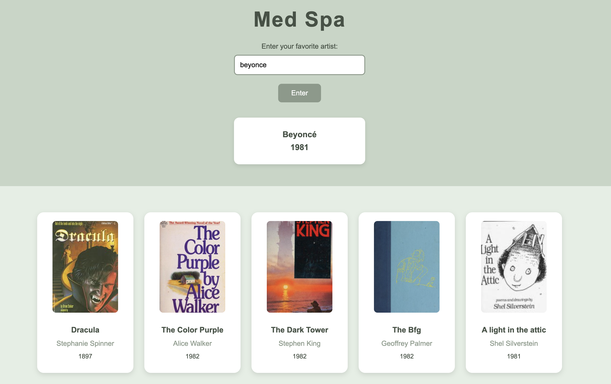

# 📚 Med Spa Book Recommendation App

A two-API web application designed to give med spa clients a fun and personalized way to discover books to read while enjoying their services.

---

## ✨ About the Project

This application was created with the **med spa experience** in mind. During longer appointments, clients may want something relaxing to do besides scrolling on their phones.

The application allows a client to enter the name of their **favorite artist or band**. Using two connected APIs, the application turns information about that artist into personalized book recommendations.

This creates a fun connection between the client's favorite music and books published around the same time.

---

## 🔎 How It Works

1. The user enters the name of their favorite **artist or band**.
2. **API #1** searches for information about the artist and retrieves their birth year or the year the band was formed.
3. That year is then passed into **API #2**.
4. The second API searches for books published within a **five-year range** surrounding that year.
5. The user receives **five book options** to explore and potentially read during their appointment.

---

## 💆🏽‍♀️ Who Is It For?

This application was designed for a **med spa or wellness environment**.

Instead of spending an entire appointment scrolling through a phone, clients can discover something new to read while relaxing or receiving a service.

---

## 🛠️ Built With

- HTML
- CSS
- JavaScript
- REST APIs
- Fetch API
- DOM Manipulation

---

## 📸 Project Preview



---

## 💡 What I Practiced

This project gave me experience working with **multiple APIs within one application**.

I practiced taking information returned from the **first API** and using that data to create the request for the **second API**.

Some of the skills I practiced include:

- Making API requests with `fetch()`
- Working with JSON data
- Accessing nested API data
- Passing data between API requests
- Dynamically displaying API results in the DOM
- Using JavaScript to calculate a range of years
- Connecting multiple APIs together
- Building an application around a real-world client use case

---


## 💻 Run This Project Locally

Want to explore the project or work with the code yourself? You can either **fork** the repository or **clone** it directly to your computer.

### 🚀 Running the Project

1. Clone the project to your computer by running:

```bash
git clone https://github.com/smayanja3/complex-api-med-spa.git